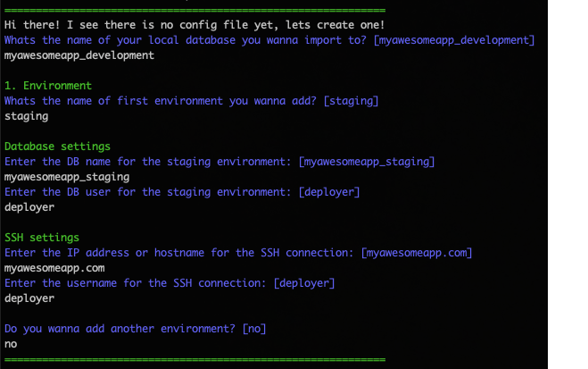

# RemoteDatabaseImporter
**RemoteDatabaseImporter** is a small gem with one specific pupose of life: Dump remote databases and import it locally.

**Currently this gem is in the BETA version!**  
Its very well possible that unexpected errors occur

## Features
- Define multiple environments (such as staging, production)
- Rails intergration via rake task
- Dump remote databases over SSH, it doesn't matter where your database is hosted



## Installation

Add this line to your application's Gemfile:

```ruby
gem 'remote_database_importer'
```

And then execute:

    $ bundle install

Or install it yourself as:

    $ gem install remote_database_importer

## Usage
Whenever you want current live data, you can run the command:

```ruby
rake remote_database:import
```

### Config
The settings for the different environments is in the `remote_database_importer.yml` file stored.  
When you first run the rake task, it will dynamically create this file for you.



## Contributing

Bug reports and pull requests are very welcome!

## License

The gem is available as open source under the terms of the [MIT License](https://opensource.org/licenses/MIT).
