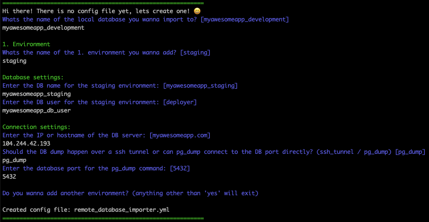

# RemoteDatabaseImporter
**RemoteDatabaseImporter** is a small gem with one specific reason to exist: Dump remote databases and import it locally.

**This gem is currently in beta phase!**  
Its well possible that unexpected errors can occur.

## Features
- Define multiple environments (such as staging, production etc.)
- Rails intergration via rake task
- Define custom commands that should run after successful import
- Decide for yourself if the dump should be done over ssh or if pg_dump should connect to the DB port directly
- It can therefore be used for almost all hosting providers (Heroku, Kubernetes, self-hosted, etc.)

## Installation

Add this line to your application's gemfile:

```ruby
gem 'remote_database_importer'
```

And then execute:

    $ bundle install

Or install it yourself as:

    $ gem install remote_database_importer

## Usage
Whenever you want current live data, you can run the command:

```ruby
rake remote_database:import
```


### Config
The settings for the different environments is stored in the `remote_database_importer.yml` file.  
When you first run the rake task, it will dynamically create this file for you.




### DB Access
The dump of the remote database happens with the tool: [pg_dump](https://www.postgresql.org/docs/current/app-pgdump.html). 
There are two opions for connecting to the remote databse:
- pg_dump connects directly to the databse
- pg_dump connects through a shh tunnel to the databse

The effective dump call is as follows:
```ruby
"ssh SSH_USER@HOST -p SSH_PORT 'pg_dump -Fc -U DB_USER -d DB_NAME -h localhost -C' > DB_DUMP_LOCATION"
or
"pg_dump -Fc 'host=HOST dbname=DB_NAME user=DB_USER port=POSTGRES_PORT' > DB_DUMP_LOCATION"
```

### Password Input
Because this gem doesn't store passwords you will have to enter the passwords manually during the rake task.  
Depending on the choosen connection model the password prompt will be for the ssh connection or the DB access.  
If you choose to dump the databse over an ssh_tunnel, the easiest way will be to exchange your ssh-key with the server beforehand, so you don't have to enter a password.  

## Limitations
- At the moment only Postgres databases are supported
- It has to run inside a Rails app.
- Not suitable for very large databases, you could run into SSH timeouts

## Contributing

Bug reports and pull requests are very welcome!

## License

The gem is available as open source under the terms of the [MIT License](https://opensource.org/licenses/MIT).
